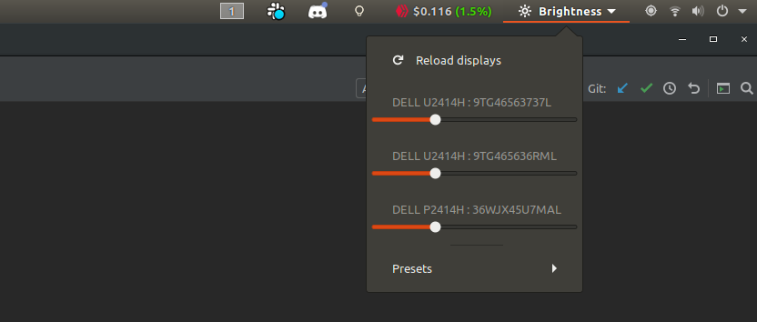

# DDC Brightness Control

Simple GNOME extension to control displays' brightness via DDC.



## Preparation

1. Install `ddcutil`: [https://www.ddcutil.com](https://www.ddcutil.com)
2. Set I2C permissions for non-root users: [https://lexruee.ch/setting-i2c-permissions-for-non-root-users.html](https://lexruee.ch/setting-i2c-permissions-for-non-root-users.html)

## Installation

### Official GNOME Shell Extensions website

[](https://extensions.gnome.org/extension/2944/ddc-brightness-control/)

### Manually from git repository

Prepare extension directory:

```bash
git clone git@gitlab.com:bgornicki/gnome-ddc-brightness-control.git
mkdir -p ~/.local/share/gnome-shell/extensions/ddc-brightness-control@bgornicki.gitlab.com
cp -R src/* ~/.local/share/gnome-shell/extensions/ddc-brightness-control@bgornicki.gitlab.com/
```

Enable extension:

 - `gnome-shell-extension-tool --enable ddc-brightness-control@bgornicki.gitlab.com`

Restart GNOME:

 - Press `Alt + F2`, type `r` and press `Enter`.

# Debugging

The extension was developed and tested for `3.28` GNOME version. If you have other version, and it's working, please let me know. Otherwise, please create an issue with some details.

How to see error messages:

 - Press `Alt + F2`, type `lg` and press Enter
 - Open `Extensions` tab
 - Find `DDC Brightness Control` extension and click `Show errors`

Alternatively, you can inspect stderr with `journalctl -f` and then reloading GNOME with `Alt + F2` and `r`. You should find a message starting with `Extension "ddc-brightness-control@bgornicki.gitlab.com" had error:`.

## Development

Contributions are welcome but make sure you follow [requirements and tips for getting your GNOME Shell Extension approved](https://wiki.gnome.org/Projects/GnomeShell/Extensions/Review).

## Compiling settings schemas

If you add or change settings, you need to recompile schemas with: 

```glib-compile-schemas src/schemas/```

### ESLint

Gitlab CI/CD is configured to fire `eslint` job on every merge request. Changes cannot be merged if the pipeline fails. 

Install and run ESLint before you do any contribution:

```shell script
npm i eslint
node_modules/eslint/bin/eslint.js ./src --fix
